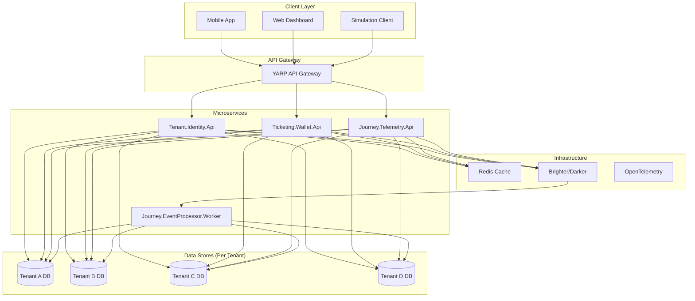

# Municipality Ticketing System

## 🚌 Proje Açıklaması

Belediyeler için geliştirilen yüksek ölçeklenebilir, multi-tenant otobüs biletleme sistemi. Bu proje, 15 kişilik hayali bir yazılım ekibinin proje lideri tarafından, DDD (Domain-Driven Design) prensipleri ve mikroservis mimarisi kullanılarak geliştirilmektedir.

### Senaryo
- **İlk Müşteriler**: 4 belediye
- **Performans Hedefi** (her belediye için):
  - 10 milyon+ günlük aktif bilet kullanımı
  - 100.000+ günlük bilet/kredi satın alma
  - 10.000+ günlük otobüs yolculuğu takibi
- **Kritik Gereksinimler**: Multi-tenancy, fault isolation, zero-downtime deployment

---

## 🏗️ Mimari



---

## 🛠️ Teknolojiler

| Kategori | Araç | Lisans |
|----------|------|--------|
| Framework | .NET 10 | MIT |
| Message Bus | Brighter & Darker | Apache 2.0 |
| ORM | Entity Framework Core 10 | MIT |
| Cache | StackExchange.Redis | MIT |
| Validation | FluentValidation | Apache 2.0 |
| Logging | Serilog | Apache 2.0 |
| Tracing | OpenTelemetry | Apache 2.0 |
| API Gateway | YARP | MIT |
| Testing | xUnit, Moq, Shouldly | Various |
| Container | Docker | Apache 2.0 |

---

## 📌 Kapsam Gerceklik Durumu (MVP vs Hedef)

Bu repo Step 01-11 icin teknik bir MVP akisi sunar. Ancak Step dokumanlarinda tanimlanan tum business/hedef gereksinimleri henuz tam olarak production seviyesinde tamamlanmamistir.

### Su an kodda bulunanlar
- Shared Kernel + EF Core + Redis tabanli altyapi
- Identity/Wallet/Telemetry minimal endpointleri ve temel domain kurallari
- Event processor (in-memory queue, retry, dead-letter, idempotency)
- YARP gateway routing + tenant header zorunlulugu + basic rate limit
- Unit ve integration testlerin temel kapsami
- Docker compose ile lokal ortam kurulumu

### Henuz eksik veya kismi kalan kritik hedefler
- JWT authentication ve RBAC (FR-001) tam uygulanmadi
- Bilet yonetimi (FR-003: QR, iade/iptal, ticket lifecycle) ayri bir servis olarak uygulanmadi
- Brighter/Darker gercek mesajlasma entegrasyonu yerine worker tarafinda in-memory queue kullaniliyor
- Serilog/OpenTelemetry/Prometheus/Grafana gozlemlenebilirlik zinciri tam entegre degil
- CI/CD, zero-downtime deployment ve feature flag gibi operasyonel hedefler dokumante ama kod/pipeline seviyesinde tam uygulanmadi

Not: Step durumlarinin "tamamlandi" olmasi, adim bazli MVP tesliminin tamamlandigini ifade eder; tum BR/FR/NFR hedeflerinin production-hardening seviyesinde bittiği anlamina gelmez.

---

## 📁 Proje Yapısı

```
MunicipalityTicketing/
├── core/                          # Shared Kernel
│   └── SharedKernel/
│       ├── Domain/                # Base classes, interfaces
│       │   ├── Common/
│       │   ├── Entities/
│       │   ├── Events/
│       │   └── Repositories/
│       └── Infrastructure/        # EF Core, Redis implementations
│           ├── Persistence/
│           └── Repositories/
├── services/                      # Microservices
│   ├── identity/                  # Tenant.Identity.Api - Kullanıcı yönetimi
│   ├── wallet/                    # Ticketing.Wallet.Api - Cüzdan ve ödeme işlemleri
│   └── telemetry/                 # Journey.Telemetry.Api - Yolculuk takibi
├── workers/                       # Background Workers
│   └── event-processor/           # Journey.EventProcessor.Worker - Asenkron event processing
├── gateway/                       # API Gateway
│   └── ApiGateway.Yarp/           # YARP reverse proxy
├── tools/                         # Development Tools
│   └── simulator/                 # Load testing clients
├── tests/
│   ├── MunicipalityTicketing.UnitTests
│   └── MunicipalityTicketing.IntegrationTests
├── docs/
│   ├── skills.md                  # Developer guidelines
│   ├── Step-00-Planlama.md        # Requirements & architecture
│   ├── Step-01-InitialSetup.md    # Initial setup steps
│   └── Step-XX-*.md               # Diğer adımlar
├── docker-compose.yml
├── MunicipalityTicketing.slnx
└── README.md
```

---

## 📋 Dokümantasyon

| Dosya | Açıklama |
|-------|----------|
| [docs/skills.md](docs/skills.md) | Developer becerileri ve kodlama standartları |
| [docs/Step-00-Planlama.md](docs/Step-00-Planlama.md) | İş gereksinimleri, mimari, tool set |
| [docs/Step-01-InitialSetup.md](docs/Step-01-InitialSetup.md) | Proje kurulumu ve temizlik adımları |
| [docs/Step-02-SharedKernel.md](docs/Step-02-SharedKernel.md) | Shared Kernel domain ve infrastructure adımları |
| [docs/Step-03-Infrastructure.md](docs/Step-03-Infrastructure.md) | EF Core ve Redis altyapı hazırlığı |
| [docs/Step-04-IdentityService.md](docs/Step-04-IdentityService.md) | Identity domain, persistence ve API adımları |
| [docs/Step-05-WalletService.md](docs/Step-05-WalletService.md) | Wallet domain, persistence ve API adımları |
| [docs/Step-06-TelemetryService.md](docs/Step-06-TelemetryService.md) | Telemetry domain, persistence ve API adımları |
| [docs/Step-07-EventProcessor.md](docs/Step-07-EventProcessor.md) | Event consumer, retry ve dead-letter adımları |
| [docs/Step-08-ApiGateway.md](docs/Step-08-ApiGateway.md) | Gateway routing, header ve rate-limit adımları |
| [docs/Step-09-Testing.md](docs/Step-09-Testing.md) | Unit ve integration test adımları |
| [docs/Step-10-SimulationClients.md](docs/Step-10-SimulationClients.md) | Simulator ile gateway uzerinden yuk testi adımları |
| [docs/Step-11-DockerDeployment.md](docs/Step-11-DockerDeployment.md) | Docker compose kurulumu ve event bus deployment adımları |

---

## 🚀 Başlangıç

### Gereksinimler
- .NET 10 SDK
- Docker & Docker Compose
- Git

### Kurulum (Yakında)
```bash
# Clone repository
git clone <repo-url>
cd MunicipalityTicketing

# Build solution
dotnet build

# Run with Docker Compose
docker-compose up -d
```

---

## 🧪 Test Senaryoları

Proje tamamlandığında simulation client'ları ile aşağıdaki senaryolar test edilecek:

1. **Load Testing**: 10M+ daily transactions
2. **Failure Scenarios**: Database failures, message bus downtime
3. **Multi-Tenant Isolation**: Cross-tenant data access prevention
4. **Zero-Downtime Updates**: Rolling deployment validation

---

## 📝 Geliştirme Adımları

| Step | Konu | Durum |
|------|------|-------|
| 00 | Planlama ve Gereksinimler | ✅ Tamamlandı |
| 01 | Initial Setup - Template Temizliği | ✅ MVP Tamamlandı |
| 02 | Shared Kernel - Domain Base Classes | ✅ MVP Tamamlandı |
| 03 | Infrastructure - EF Core & Redis | ✅ MVP Tamamlandı |
| 04 | Identity Service | ✅ MVP Tamamlandı |
| 05 | Wallet Service | ✅ MVP Tamamlandı |
| 06 | Telemetry Service | ✅ MVP Tamamlandı |
| 07 | Event Processor | ✅ MVP Tamamlandı |
| 08 | API Gateway | ✅ MVP Tamamlandı |
| 09 | Testing | ✅ MVP Tamamlandı |
| 10 | Simulation Clients | ✅ MVP Tamamlandı |
| 11 | Docker & Deployment | ✅ MVP Tamamlandı |

---

## 👨‍💻 Proje Lideri

**Özgür Can TURNA**  
*Proje Lideri ve Tek Geliştirici (Simülasyon)*

Bu proje, gerçek bir 15 kişilik ekip çalışmasını simüle etmek amacıyla DDD ve mikroservis best practice'lerini uygulamak için oluşturulmuştur.

---

## 📄 Lisans

MIT License - Detaylar için LICENSE dosyasına bakınız.
