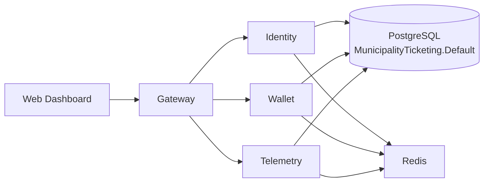

# Current MVP Architecture

> This document describes the current MVP implementation state. It differs from the target architecture defined in `Step-00-Planlama.md`.

## Services

| Service | Status | Endpoints | Notes |
| ------- | ------ | --------- | ----- |
| Identity | ✅ MVP | `/api/users`, `/api/auth` | JWT auth, BCrypt hashing, demo seed data |
| Wallet | ✅ MVP | `/api/wallet` | Balance operations, Redis caching |
| Telemetry | ✅ MVP | `/api/telemetry` | Journey tracking placeholder |
| Event Processor | ⚠️ In-Memory | N/A | Uses `InMemoryEventQueue`, not RabbitMQ |
| Gateway | ✅ MVP | Routes: `/api/identity/*`, `/api/wallet/*`, `/api/telemetry/*` | YARP, JWT validation, rate limiting |

## Data Flow

## Authentication & Tenant Model

- **JWT bearer tokens** for authentication
- **X-Tenant-Id header** validated at gateway
- **Tenant claim** in JWT must match header
- **Tenant ID format**: GUIDs (e.g., `7f4c8c0f-1d7b-4d52-8a4d-000000000001`)
- Demo tenants: Bursa, Eskişehir, Van, Mersin

## Infrastructure Components

| Component | Status | Notes |
| --------- | ------ | ----- |
| PostgreSQL | ✅ Active | Single `MunicipalityTicketing.Default` database |
| Redis | ✅ Active | `muni:` prefix, caching layer |
| RabbitMQ | ⚠️ Idle | Container running but no service integration |
| OpenTelemetry | ⚠️ Partial | Traces only, no metrics/Prometheus/Jaeger |

## Known Risks

| Risk | Impact | Status |
| ---- | ------ | ------ |
| Tenant ID mismatch | Auth failures | Frontend uses `"bursa"`, backend expects GUIDs |
| No global exception handling | Unhandled errors | Program.cs lacks exception middleware |
| Repository no tenant isolation | Data leaks | Each service handles manually |
| Missing observability stack | No metrics/alerting | Serilog, Prometheus, Grafana, Jaeger not integrated |
| Event processor not persistent | Message loss | InMemoryEventQueue not production-ready |

## Missing Target Components

| Component | Target State |
| --------- | ------------ |
| Database-per-Tenant | Multiple tenant DBs |
| Ticketing Service | Ticket lifecycle, QR, refund/cancel |
| RabbitMQ transport | Brighter & Darker event bus |
| CQRS | Command/query separation |
| FluentValidation | Request validation |
| AutoMapper | DTO mapping layer |
| Polly | Resilience patterns |
| CQRS | Command/query handlers |
| Web Dashboard RBAC | Protected routes, real auth flow