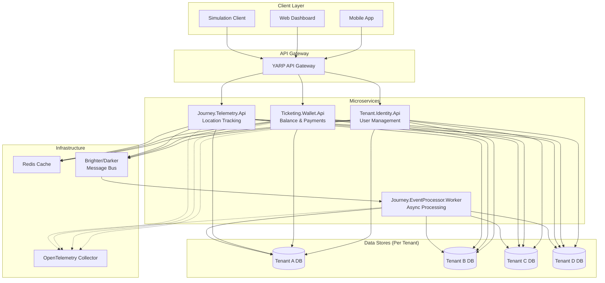

# Step 00: Planlama ve Gereksinimler

## 📋 Senaryo Özeti

15 kişilik bir yazılım geliştirme ekibinin proje liderisiniz. Belediyelerde kullanılmak üzere bir otobüs biletleme sistemi geliştireceksiniz.

### Başlangıç Koşulları
- **İlk Müşteriler**: 4 farklı belediye
- **Büyüme Beklentisi**: Zamanla hızla artacak
- **Teslimat Süresi**: 6 ay (ilk versiyon)

### Performans Gereksinimleri (Her Belediye İçin)
- **Aktif Bilet Kullanımı**: 10 milyon+/gün
- **Bilet/Kredi Satın Alma**: 100.000+/gün
- **Otobüs Yolculuğu Takibi**: 10.000+/gün

### Kritik Kısıtlar
1. **Multi-Tenancy**: Her belediye bağımsız çalışmalı
2. **Fault Isolation**: Bir belediyedeki sorun diğerlerini etkilememeli
3. **Zero-Downtime Deployment**: Güncellemeler sistem durdurulmadan yapılmalı
4. **Hızlı Güncelleme**: Radical değişiklikler dışında 1 hafta içinde deployment

---

## 🎯 Business Requirements (İş Gereksinimleri)

### BR-001: Multi-Tenant Yapı
- Her belediye kendi verisine sahip olmalı
- Tenants arası veri sızıntısı olmamalı
- Her tenant için ayrı ölçeklendirme yapılabilmeli

### BR-002: Yüksek Kullanılabilirlik
- Sistem %99.9 uptime sağlamalı
- Tek bir servis arızası tüm sistemi düşürmemeli
- Otomatik recovery mekanizmaları olmalı

### BR-003: Ölçeklenebilirlik
- Yatay ölçeklendirme desteklenmeli
- Load balancing otomatik yapılmalı
- Database sharding stratejisi olmalı

### BR-004: Güvenlik
- Kullanıcı kimlik doğrulaması güvenli olmalı
- Veriler şifrelenmeli (at-rest & in-transit)
- Audit logging tüm kritik işlemleri kaydetmeli

### BR-005: Continuous Deployment
- Blue-green veya rolling deployment desteklenmeli
- Rollback mekanizması hızlı olmalı
- Feature flags ile kontrollü rollout

---

## ⚙️ Functional Requirements (Fonksiyonel Gereksinimler)

### FR-001: Kullanıcı Yönetimi (Identity Service)
- Kullanıcı kaydı ve girişi
- JWT tabanlı authentication
- Role-based access control (RBAC)
- Şifre sıfırlama ve hesap yönetimi

### FR-002: Cüzdan İşlemleri (Wallet Service)
- Bakiye sorgulama
- Para yükleme (kredi satın alma)
- Bilet alımında bakiye düşümü
- İşlem geçmişi

### FR-003: Bilet Yönetimi (Ticketing Service)
- Bilet oluşturma ve validasyon
- QR kod üretimi
- Bilet durumu takibi (aktif, kullanıldı, iptal)
- İade ve iptal işlemleri

### FR-004: Yolculuk Takibi (Telemetry Service)
- Otobüs konum takibi
- Check-in/check-out işlemleri
- Rota optimizasyonu
- Gerçek zamanlı yolcu sayısı

### FR-005: Event Processing (Event Processor)
- Asenkron event handling
- Event sourcing pattern
- Retry ve circuit breaker
- Dead letter queue yönetimi

### FR-006: API Gateway
- Request routing
- Authentication middleware
- Rate limiting per tenant
- Request/Response logging

---

## 📊 Non-Functional Requirements (Fonksiyonel Olmayan Gereksinimler)

### NFR-001: Performance
- API response time < 200ms (p95)
- Database query time < 50ms (p95)
- Throughput: 10K requests/second per tenant

### NFR-002: Scalability
- Auto-scaling based on CPU/memory usage
- Database connection pooling
- Distributed caching (Redis)

### NFR-003: Reliability
- Circuit breaker pattern
- Retry with exponential backoff
- Health checks (liveness/readiness)

### NFR-004: Security
- TLS 1.3 for all communications
- AES-256 encryption for sensitive data
- OWASP Top 10 compliance
- Regular security audits

### NFR-005: Observability
- Structured logging (Serilog)
- Distributed tracing (OpenTelemetry)
- Metrics collection (Prometheus)
- Alerting (Grafana)

### NFR-006: Maintainability
- Clean architecture principles
- DDD tactical patterns
- Comprehensive test coverage (>80%)
- Automated CI/CD pipeline

---

## 🛠️ Tool Set & Teknolojiler

| Kategori | Araç | Lisans | Açıklama |
|----------|------|--------|----------|
| **Framework** | .NET 10 | MIT | Backend development |
| **Message Bus** | Brighter & Darker | Apache 2.0 | Event-driven architecture |
| **ORM** | Entity Framework Core 10 | MIT | Data persistence |
| **Cache** | StackExchange.Redis | MIT | Distributed caching |
| **Validation** | FluentValidation | Apache 2.0 | Request validation |
| **Mapping** | AutoMapper | MIT | DTO mapping |
| **Logging** | Serilog | Apache 2.0 | Structured logging |
| **Tracing** | OpenTelemetry | Apache 2.0 | Distributed tracing |
| **API Gateway** | YARP | MIT | Reverse proxy |
| **Testing** | xUnit, Moq, Shouldly | Various | Unit & integration tests |
| **Container** | Docker | Apache 2.0 | Containerization |
| **Orchestration** | Docker Compose | Apache 2.0 | Local development |

### Neden Brighter & Darker?
- **MassTransit alternatifi**: Daha hafif, daha fazla kontrol
- **Command/Query Separation**: CQRS pattern native support
- **Outbox Pattern**: Transactional message publishing
- **Scheduler**: Delayed job execution
- **Community**: Aktif open-source community

---

## 🏗️ Genel Sistem Mimarisi



### Mimari Kararlar

#### 1. Database-per-Tenant Pattern
- **Avantaj**: Tam izolasyon, kolay backup/restore, compliance
- **Dezavantaj**: Connection overhead, migration complexity
- **Çözüm**: Connection pooling, schema-based multi-tenancy option

#### 2. Event-Driven Architecture
- **Brighter Command Processor**: Sync operations
- **Darker Event Handlers**: Async event processing
- **Outbox Pattern**: Reliable message delivery

#### 3. CQRS Pattern
- **Commands**: Write operations (CreateTicket, DeductBalance)
- **Queries**: Read operations (GetBalance, GetTicketHistory)
- **Separate Models**: Optimized for read/write patterns

#### 4. Circuit Breaker & Retry
- **Polly Policies**: Transient fault handling
- **Exponential Backoff**: Prevent cascade failures
- **Fallback**: Graceful degradation

---

## 📁 Proje Yapısı

```
MunicipalityTicketing/
├── core/                      # Shared Kernel
│   ├── SharedKernel.Domain/   # Base classes, interfaces
│   └── SharedKernel.Infrastructure/  # EF Core, Redis, etc.
├── services/                  # Microservices
│   ├── identity/              # Tenant.Identity.Api
│   ├── wallet/                # Ticketing.Wallet.Api
│   └── telemetry/             # Journey.Telemetry.Api
├── workers/                   # Background Workers
│   └── event-processor/       # Journey.EventProcessor.Worker
├── gateway/                   # API Gateway
│   └── ApiGateway.Yarp/
├── tools/                     # Development Tools
│   └── simulator/             # Load testing clients
├── tests/
│   ├── MunicipalityTicketing.UnitTests/
│   └── MunicipalityTicketing.IntegrationTests/
├── docs/
│   ├── skills.md
│   ├── Step-00-Planlama.md
│   ├── Step-01-InitialSetup.md
│   └── Step-XX-*.md
├── docker-compose.yml
├── README.md
└── MunicipalityTicketing.slnx
```

---

## 📝 Sonraki Adımlar

1. **Step 01**: Initial Setup - Template temizliği, solution yapısı
2. **Step 02**: Shared Kernel - Domain base classes, interfaces
3. **Step 03**: Infrastructure - EF Core, Redis setup
4. **Step 04**: Identity Service - User management implementation
5. **Step 05**: Wallet Service - Balance & payment operations
6. **Step 06**: Telemetry Service - Location tracking
7. **Step 07**: Event Processor - Async event handling
8. **Step 08**: API Gateway - YARP configuration
9. **Step 09**: Testing - Unit & integration tests
10. **Step 10**: Simulation - Load testing clients
11. **Step 11**: Docker & Deployment - Container orchestration

---

**Doküman Durumu**: Draft  
**Son Güncelleme**: 2024  
**Yazar**: Özgür Can TURNA
