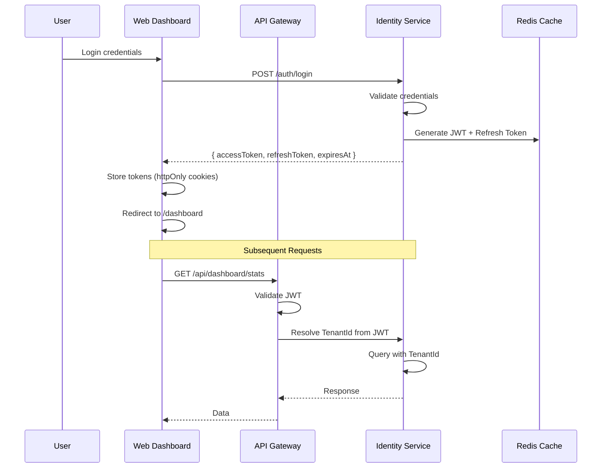

# Step 13: Web Dashboard - Belediye Yönetim Paneli

> **Amaç**: Belediye operatörleri ve yöneticileri için merkezi yönetim paneli  
> **Teknoloji**: React 19 + TypeScript + Vite  
> **Runtime**: Node.js 22+  
> **İletişim**: REST API + WebSocket (real-time)

---

## 📋 Gereksinimler Özeti

### Business Requirements

| ID | Gereksinim | Öncelik |
| ---- | ----------- | --------- |
| WR-001 | Belediye yöneticileri kullanıcıları yönetebilmeli | P0 |
| WR-002 | Bilet satışlarını ve gelirleri takip edebilmeli | P0 |
| WR-003 | Otobüs filolarını ve rota bilgilerini görebilmeli | P0 |
| WR-004 | Gerçek zamanlı yolcu sayıları ve doluluk oranları | P1 |
| WR-005 | Raporlama ve istatistikler (günlük, haftalık, aylık) | P1 |
| WR-006 | Sistem sağlık durumu ve alertler | P2 |

### Functional Requirements

#### FR-WD-001: Authentication & Authorization

- JWT token tabanlı oturum yönetimi
- Role-based access control (Admin, Operator, Viewer)
- Session timeout ve auto-refresh
- Multi-tenant context seçimi

#### FR-WD-002: Dashboard (Ana Panel)

- Özet istatistikler (bugünkü bilet satışı, aktif yolcular, gelir)
- Hızlı erişim kartları
- Grafikler ve trend analizi
- Real-time alerts

#### FR-WD-003: Kullanıcı Yönetimi

- Kullanıcı listesi ve arama
- Yeni kullanıcı ekleme/düzenleme
- Rol atama ve yetkilendirme
- Aktif/Pasif durum yönetimi

#### FR-WD-004: Bilet Yönetimi

- Bilet listesi ve detay görüntüleme
- Bilet iptal ve iade işlemleri
- QR kod görüntüleme ve yazdırma
- Bilet durumu takibi

#### FR-WD-005: Rota ve Filo Yönetimi

- Rota listesi ve detayları
- Otobüs durumu (aktif, arızalı, bakım)
- Sürücü atamaları
- Rota performans metrikleri

#### FR-WD-006: Raporlama

- Satış raporları (günlük, haftalık, aylık, yıllık)
- Rota bazlı performans raporları
- Kullanıcı aktivite logları
- Export: PDF, Excel, CSV

#### FR-WD-007: Ayarlar

- Belediye bilgileri düzenleme
- Bilet fiyatlandırma kuralları
- Çalışma saatleri
- Bildirim ayarları

---

## 🛠️ Teknoloji Stack

### Frontend Framework

| Kategori | Teknoloji | Neden? |
| -------- | --------- | ------ |
| **Framework** | React 19 | En güncel, performans, modern API'ler |
| **Language** | TypeScript 5.6 | Tip güvenliği, IDE desteği |
| **Build Tool** | Vite | Hızlı geliştirme, modern bundling |
| **State Management** | Zustand | Basit, performanslı, minimal boilerplate |
| **Routing** | React Router 7 | Client-side routing, code splitting |
| **HTTP Client** | TanStack Query | Server state, caching, background updates |
| **Forms** | React Hook Form + Zod | Performanslı form yönetimi, validation |
| **UI Library** | shadcn/ui | Modern, erişilebilir, özelleştirilebilir |
| **Styling** | Tailwind CSS | Utility-first, hızlı geliştirme |
| **Charts** | Recharts | React native, özelleştirilebilir |
| **Icons** | Lucide React | Modern, temiz ikon seti |
| **Notifications** | sonner | Toast notifications |
| **Date Handling** | date-fns | Lightweight, functional |

### Backend Entegrasyon

| Kategori | Teknoloji | Neden? |
| -------- | --------- | ------ |
| **API Gateway** | YARP | Mevcut mimari ile uyumlu |
| **Auth** | JWT + Refresh Tokens | Stateless, güvenli |
| **Real-time** | SignalR (WebSocket) | Gerçek zamanlı veri akışı |
| **CORS** | YARP CORS policies | Cross-origin güvenlik |

---

## 🎨 UI/UX Tasarım Prensipleri

### Renk Paleti

```css
/* Primary - Belediye Mavisi */
--primary: #1e40af;
--primary-foreground: #ffffff;

/* Secondary - Gri Tonlar */
--secondary: #f3f4f6;
--secondary-foreground: #1f2937;

/* Accent - Turuncu (Action) */
--accent: #f97316;
--accent-foreground: #ffffff;

/* Success - Yeşil */
--success: #22c55e;

/* Warning - Sarı */
--warning: #eab308;

/* Error - Kırmızı */
--error: #ef4444;

/* Neutral */
--background: #ffffff;
--foreground: #111827;
--muted: #f9fafb;
--card: #ffffff;
--border: #e5e7eb;
```

### Tipografi

```css
/* Font Family */
--font-sans: 'Inter', -apple-system, BlinkMacSystemFont, 'Segoe UI', sans-serif;
--font-mono: 'JetBrains Mono', 'Fira Code', monospace;

/* Sizes */
--text-xs: 0.75rem;
--text-sm: 0.875rem;
--text-base: 1rem;
--text-lg: 1.125rem;
--text-xl: 1.25rem;
--text-2xl: 1.5rem;
--text-3xl: 1.875rem;
```

### Layout Sistemi

```text
┌─────────────────────────────────────────────────────────┐
│  Header (Logo, Tenant Selector, User Menu, Notifications)│
├──────────┬──────────────────────────────────────────────┤
│          │                                              │
│  Sidebar │         Main Content Area                    │
│  Menu    │                                              │
│          │   ┌─────────┬─────────┬─────────┬─────────┐ │
│          │   │  Card   │  Card   │  Card   │  Card   │ │
│          │   │  Stats  │  Stats  │  Stats  │  Stats  │ │
│          │   └─────────┴─────────┴─────────┴─────────┘ │
│          │                                              │
│          │   ┌─────────────────────────────────────┐   │
│          │   │         Charts & Graphs             │   │
│          │   └─────────────────────────────────────┘   │
│          │                                              │
│          │   ┌─────────────────────────────────────┐   │
│          │   │      Data Tables & Lists            │   │
│          │   └─────────────────────────────────────┘   │
│          │                                              │
└──────────┴──────────────────────────────────────────────┘
```

### Responsive Design

- **Desktop**: 1280px+ (full sidebar, multi-column layouts)
- **Tablet**: 768px-1279px (collapsed sidebar, 2-column grids)
- **Mobile**: <768px (hamburger menu, single column)

---

## 📁 Proje Yapısı

```text
web-dashboard/
├── src/
│   ├── main.tsx                    # Entry point
│   ├── App.tsx                     # Root component
│   ├── vite-env.d.ts
│   │
│   ├── components/                 # Shared UI components
│   │   ├── ui/                     # shadcn/ui components
│   │   │   ├── button.tsx
│   │   │   ├── card.tsx
│   │   │   ├── table.tsx
│   │   │   ├── dialog.tsx
│   │   │   ├── form.tsx
│   │   │   ├── input.tsx
│   │   │   ├── select.tsx
│   │   │   ├── dropdown-menu.tsx
│   │   │   ├── badge.tsx
│   │   │   └── ...
│   │   ├── layout/
│   │   │   ├── header.tsx
│   │   │   ├── sidebar.tsx
│   │   │   ├── footer.tsx
│   │   │   └── page-container.tsx
│   │   └── common/
│   │       ├── loading-spinner.tsx
│   │       ├── error-boundary.tsx
│   │       └── confirm-dialog.tsx
│   │
│   ├── features/                   # Feature-based modules
│   │   ├── auth/
│   │   │   ├── components/
│   │   │   │   ├── login-form.tsx
│   │   │   │   └── register-form.tsx
│   │   │   ├── hooks/
│   │   │   │   ├── use-auth.ts
│   │   │   │   └── use-auth-refresh.ts
│   │   │   ├── services/
│   │   │   │   └── auth-api.ts
│   │   │   └── types/
│   │   │       └── auth.types.ts
│   │   │
│   │   ├── dashboard/
│   │   │   ├── components/
│   │   │   │   ├── stats-cards.tsx
│   │   │   │   ├── revenue-chart.tsx
│   │   │   │   ├── passenger-flow.tsx
│   │   │   │   └── recent-activity.tsx
│   │   │   ├── hooks/
│   │   │   │   └── use-dashboard-stats.ts
│   │   │   └── types/
│   │   │       └── dashboard.types.ts
│   │   │
│   │   ├── users/
│   │   │   ├── components/
│   │   │   │   ├── user-table.tsx
│   │   │   │   ├── user-form.tsx
│   │   │   │   └── role-assigner.tsx
│   │   │   ├── hooks/
│   │   │   │   └── use-users.ts
│   │   │   └── types/
│   │   │       └── user.types.ts
│   │   │
│   │   ├── tickets/
│   │   │   ├── components/
│   │   │   │   ├── ticket-list.tsx
│   │   │   │   ├── ticket-detail.tsx
│   │   │   │   ├── qr-code-viewer.tsx
│   │   │   │   └── ticket-filters.tsx
│   │   │   ├── hooks/
│   │   │   │   └── use-tickets.ts
│   │   │   └── types/
│   │   │       └── ticket.types.ts
│   │   │
│   │   ├── routes/
│   │   │   ├── components/
│   │   │   │   ├── route-list.tsx
│   │   │   │   ├── route-form.tsx
│   │   │   │   └── route-map.tsx
│   │   │   ├── hooks/
│   │   │   │   └── use-routes.ts
│   │   │   └── types/
│   │   │       └── route.types.ts
│   │   │
│   │   ├── buses/
│   │   │   ├── components/
│   │   │   │   ├── bus-list.tsx
│   │   │   │   ├── bus-detail.tsx
│   │   │   │   └── bus-status.tsx
│   │   │   ├── hooks/
│   │   │   │   └── use-buses.ts
│   │   │   └── types/
│   │   │       └── bus.types.ts
│   │   │
│   │   ├── reports/
│   │   │   ├── components/
│   │   │   │   ├── report-generator.tsx
│   │   │   │   ├── date-range-picker.tsx
│   │   │   │   └── report-export.tsx
│   │   │   ├── hooks/
│   │   │   │   └── use-reports.ts
│   │   │   └── types/
│   │   │       └── report.types.ts
│   │   │
│   │   └── settings/
│   │       ├── components/
│   │       │   ├── municipality-form.tsx
│   │       │   ├── pricing-rules.tsx
│   │       │   └── notification-settings.tsx
│   │       ├── hooks/
│   │       │   └── use-settings.ts
│   │       └── types/
│   │           └── settings.types.ts
│   │
│   ├── hooks/                      # Global custom hooks
│   │   ├── use-toast.ts
│   │   ├── use-debounce.ts
│   │   ├── use-media-query.ts
│   │   └── use-local-storage.ts
│   │
│   ├── lib/                        # Utilities
│   │   ├── utils.ts
│   │   ├── api-client.ts
│   │   ├── formatters.ts
│   │   ├── validators.ts
│   │   └── constants.ts
│   │
│   ├── stores/                     # Zustand stores
│   │   ├── auth-store.ts
│   │   ├── tenant-store.ts
│   │   └── ui-store.ts
│   │
│   ├── types/                      # Global TypeScript types
│   │   ├── api.types.ts
│   │   ├── tenant.types.ts
│   │   └── common.types.ts
│   │
│   └── routes/                     # React Router routes
│       ├── index.tsx
│       ├── protected.tsx
│       └── public.tsx
│
├── public/
│   ├── favicon.ico
│   └── logos/
│       └── municipality.svg
│
├── tests/
│   ├── unit/
│   ├── integration/
│   └── e2e/
│
├── .env.example
├── .eslintrc.cjs
├── .prettierrc
├── tailwind.config.js
├── tsconfig.json
├── vite.config.ts
└── package.json
```

---

## 🗺️ Sayfa Yapısı ve Navigasyon

### Ana Sayfalar

```text
├── /login                      # Giriş sayfası
├── /register                   # Kayıt sayfası (Admin only)
│
├── /dashboard                  # Ana panel (default)
│   ├── Stats Overview
│   ├── Revenue Chart (7 days)
│   ├── Passenger Flow
│   └── Recent Activity
│
├── /users                      # Kullanıcı yönetimi
│   ├── /users                  # Kullanıcı listesi
│   ├── /users/new              # Yeni kullanıcı ekle
│   ├── /users/:id              # Kullanıcı detayı
│   └── /users/:id/edit         # Kullanıcı düzenle
│
├── /tickets                    # Bilet yönetimi
│   ├── /tickets                # Bilet listesi
│   ├── /tickets/:id            # Bilet detayı
│   ├── /tickets/:id/refund     # İade işlemi
│   └── /tickets/search         # Bilet arama
│
├── /routes                     # Rota yönetimi
│   ├── /routes                 # Rota listesi
│   ├── /routes/new             # Yeni rota ekle
│   ├── /routes/:id             # Rota detayı
│   ├── /routes/:id/edit        # Rota düzenle
│   └── /routes/:id/map         # Rota harita görünümü
│
├── /buses                      # Filo yönetimi
│   ├── /buses                  # Otobüs listesi
│   ├── /buses/:id              # Otobüs detayı
│   ├── /buses/:id/maintenance  # Bakım geçmişi
│   └── /buses/assign           # Sürücü atama
│
├── /reports                    # Raporlama
│   ├── /reports/sales          # Satış raporları
│   ├── /reports/routes         # Rota performans
│   ├── /reports/users          # Kullanıcı aktivite
│   └── /reports/custom         # Özel rapor oluşturucu
│
├── /settings                   # Ayarlar
│   ├── /settings/municipality  # Belediye bilgileri
│   ├── /settings/pricing       # Fiyatlandırma kuralları
│   ├── /settings/notifications # Bildirim ayarları
│   └── /settings/security      # Güvenlik ayarları
│
└── /profile                    # Profil ayarları
    ├── /profile                # Profil bilgileri
    ├── /profile/password       # Şifre değiştir
    └── /profile/preferences    # Tercihler
```

### Sidebar Menü Yapısı

```text
┌─────────────────────────────┐
│  🏠 Dashboard               │
├─────────────────────────────┤
│  👥 Kullanıcılar            │
│     ├── Liste               │
│     └── Yeni Ekle           │
├─────────────────────────────┤
│  🎫 Biletler                │
│     ├── Liste               │
│     └── Arama               │
├─────────────────────────────┤
│  🚌 Rotalar                 │
│     ├── Liste               │
│     └── Harita              │
├─────────────────────────────┤
│  🚍 Filo Yönetimi           │
│     ├── Otobüsler           │
│     └── Sürücüler           │
├─────────────────────────────┤
│  📊 Raporlar                │
│     ├── Satışlar            │
│     ├── Rotalar             │
│     └── Özel Rapor          │
├─────────────────────────────┤
│  ⚙️ Ayarlar                 │
│     ├── Belediye            │
│     ├── Fiyatlandırma       │
│     └── Bildirimler         │
├─────────────────────────────┤
│  👤 Profil                  │
└─────────────────────────────┘
```

---

## 🔌 API Entegrasyon Stratejisi

### API Gateway Yapısı

```text
Client (Web Dashboard)
        ↓
   [HTTPS]
        ↓
┌───────────────────┐
│  YARP Gateway     │
│  /api/*           │
└───────────────────┘
        ↓
   ┌────┴────┬──────┴──────┬──────┴─────┐
   ↓         ↓              ↓             ↓
Identity   Wallet      Telemetry    EventProc
Api        Api          Api          Worker
```

### Authentication Flow



### API Client Yapısı

```typescript
// lib/api-client.ts
export class ApiClient {
  private baseURL: string;
  private token: string;

  constructor(baseURL: string, token?: string) {
    this.baseURL = baseURL;
    this.token = token || this.getStoredToken();
  }

  async get<T>(endpoint: string): Promise<T> {
    const response = await fetch(`${this.baseURL}${endpoint}`, {
      headers: {
        'Authorization': `Bearer ${this.token}`,
        'X-Tenant-Id': this.getTenantId(),
      },
    });

    if (!response.ok) {
      if (response.status === 401) {
        await this.refreshToken();
        return this.get<T>(endpoint);
      }
      throw new ApiError(response);
    }

    return response.json();
  }

  async post<T>(endpoint: string, data: unknown): Promise<T> {
    // POST implementation
  }

  private async refreshToken(): Promise<void> {
    // Refresh token logic
  }

  private getStoredToken(): string {
    // Get from httpOnly cookie
  }

  private getTenantId(): string {
    // Get from store or JWT
  }
}
```

### TanStack Query Kullanımı

```typescript
// features/dashboard/hooks/use-dashboard-stats.ts
export function useDashboardStats() {
  return useQuery({
    queryKey: ['dashboard-stats'],
    queryFn: async () => {
      const response = await apiClient.get<DashboardStats>('/dashboard/stats');
      return response;
    },
    staleTime: 1000 * 60, // 1 minute
    refetchInterval: 1000 * 30, // Refetch every 30 seconds
    refetchOnWindowFocus: true,
  });
}
```

### WebSocket Real-time Updates

```typescript
// lib/websocket-client.ts
export class WebSocketClient {
  private ws: WebSocket | null = null;
  private reconnectAttempts = 0;
  private maxReconnectAttempts = 5;

  connect(token: string, tenantId: string) {
    const url = `wss://${window.location.host}/ws?token=${token}&tenant=${tenantId}`;
    this.ws = new WebSocket(url);

    this.ws.onmessage = (event) => {
      const data = JSON.parse(event.data);
      this.handleMessage(data);
    };

    this.ws.onclose = () => this.reconnect();
    this.ws.onerror = (error) => console.error('WS Error:', error);
  }

  private handleMessage(data: RealTimeMessage) {
    switch (data.type) {
      case 'BUS_LOCATION_UPDATE':
        this.onBusLocationUpdate(data.payload);
        break;
      case 'TICKET_PURCHASED':
        this.onTicketPurchased(data.payload);
        break;
      case 'ALERT':
        this.onAlert(data.payload);
        break;
    }
  }

  private reconnect() {
    if (this.reconnectAttempts < this.maxReconnectAttempts) {
      this.reconnectAttempts++;
      setTimeout(() => this.connect(this.token, this.tenantId), 5000);
    }
  }
}
```

---

## 🔐 Güvenlik ve Kimlik Doğrulama

### JWT Token Yapısı

```json
{
  "sub": "user-123",
  "tenantId": "tenant-456",
  "role": "admin",
  "permissions": ["users:read", "users:write", "tickets:read"],
  "iat": 1623456789,
  "exp": 1623460389
}
```

### Refresh Token Stratejisi

- **Access Token**: 15 dakika geçerlilik
- **Refresh Token**: 7 gün geçerlilik
- **Rotation**: Her refresh yeni token çifti
- **Revocation**: Logout'ta refresh token blacklist'e eklenir

### CORS Yapılandırması

```typescript
// gateway/Program.cs
builder.Services.AddReverseProxy()
  .LoadFromConfig(config.GetSection("ReverseProxy"))
  .AddTransforms(context =>
  {
    context.AddResponseHeader("Access-Control-Allow-Origin", allowedOrigins);
    context.AddResponseHeader("Access-Control-Allow-Credentials", "true");
  });
```

### XSS ve CSRF Koruması

- **XSS**: React'in built-in escaping, Content Security Policy headers
- **CSRF**: SameSite=Strict cookies, CSRF tokens for state-changing operations
- **SQL Injection**: EF Core parameterized queries
- **No-SNIFF**: X-Content-Type-Options header

---

## 📊 State Management Stratejisi

### Zustand Store Yapısı

```typescript
// stores/auth-store.ts
interface AuthState {
  user: User | null;
  tenant: Tenant | null;
  isAuthenticated: boolean;
  login: (credentials: LoginCredentials) => Promise<void>;
  logout: () => Promise<void>;
  setTenant: (tenantId: string) => void;
}

export const useAuthStore = create<AuthState>((set, get) => ({
  user: null,
  tenant: null,
  isAuthenticated: false,

  login: async (credentials) => {
    const { user, tenant, accessToken, refreshToken } = await apiClient.login(credentials);
    set({ user, tenant, isAuthenticated: true });
    // Store tokens in httpOnly cookies
  },

  logout: async () => {
    await apiClient.logout();
    set({ user: null, tenant: null, isAuthenticated: false });
  },

  setTenant: (tenantId) => {
    set({ tenant: tenantId });
    // Update X-Tenant-Id header
  },
}));
```

### Server State vs Client State

| Durum Türü | Yönetim Aracı | Örnek |
| ---------- | ------------- | ----- |
| **Server State** | TanStack Query | API'den gelen veriler |
| **Client State** | Zustand | UI durumu, modal açılışı |
| **Form State** | React Hook Form | Form input değerleri |
| **URL State** | React Router | Query params, route params |

---

## 🧪 Test Stratejisi

### Unit Tests

```typescript
// tests/unit/features/auth/login-form.test.tsx
describe('LoginForm', () => {
  it('should display validation error for invalid email', async () => {
    render(<LoginForm />);
    const emailInput = screen.getByLabelText(/email/i);
    const submitButton = screen.getByRole('button', { name: /login/i });

    await userEvent.type(emailInput, 'invalid-email');
    await userEvent.click(submitButton);

    expect(screen.getByText(/invalid email/i)).toBeInTheDocument();
  });
});
```

### Integration Tests

```typescript
// tests/integration/features/dashboard/stats.test.tsx
describe('Dashboard Stats', () => {
  it('should load and display dashboard statistics', async () => {
    const mockStats = {
      totalTickets: 1500,
      totalRevenue: 45000,
      activePassengers: 320,
    };

    fetch.mockResponseOnce(JSON.stringify(mockStats));

    render(<Dashboard />);

    await screen.findByText('1,500');
    expect(screen.getByText('₺45,000')).toBeInTheDocument();
  });
});
```

### E2E Tests (Playwright)

```typescript
// tests/e2e/auth.spec.ts
test.describe('Authentication', () => {
  test('should login successfully', async ({ page }) => {
    await page.goto('/login');
    await page.fill('[name="email"]', 'admin@municipality.test');
    await page.fill('[name="password"]', 'password123');
    await page.click('button[type="submit"]');

    await page.waitForURL('/dashboard');
    expect(page).toHaveURL('/dashboard');
  });
});
```

---

## 🚀 Performans Optimizasyonları

### Code Splitting

```typescript
// routes/index.tsx
import { lazy, Suspense } from 'react';

const Dashboard = lazy(() => import('../features/dashboard'));
const Users = lazy(() => import('../features/users'));
const Tickets = lazy(() => import('../features/tickets'));

// Route lazy loading
const Route = lazy(() => import('../features/routes'));
const Buses = lazy(() => import('../features/buses'));
```

### Image Optimization

- WebP format with fallback
- Lazy loading for below-fold images
- Responsive images (srcset)

### Bundle Analysis

```bash
# vite.config.ts
export default defineConfig({
  build: {
    rollupOptions: {
      output: {
        manualChunks: {
          'react-vendor': ['react', 'react-dom', 'react-router'],
          'ui-vendor': ['shadcn/ui', 'tailwind-merge'],
          'chart-vendor': ['recharts'],
        },
      },
    },
  },
});
```

---

## 📱 Responsive ve Erişilebilirlik

### Breakpoints

```css
/* tailwind.config.js */
theme: {
  extend: {
    screens: {
      'xs': '480px',
      'sm': '640px',
      'md': '768px',
      'lg': '1024px',
      'xl': '1280px',
      '2xl': '1536px',
    },
  },
}
```

### Accessibility (a11y)

- **ARIA labels** for all interactive elements
- **Keyboard navigation** support
- **Focus management** for modals and dialogs
- **Color contrast** WCAG AA compliant
- **Screen reader** testing

---

## 📦 Deployment

### Build Process

```bash
# Production build
npm run build

# Output: dist/ folder
# Optimized, minified, tree-shaken
```

### Docker Containerization

```dockerfile
# Dockerfile
FROM node:22-alpine AS builder

WORKDIR /app
COPY package*.json ./
RUN npm ci
COPY . .
RUN npm run build

FROM nginx:alpine

COPY --from=builder /app/dist /usr/share/nginx/html
COPY nginx.conf /etc/nginx/conf.d/default.conf

EXPOSE 80
CMD ["nginx", "-g", "daemon off;"]
```

### Environment Variables

```env
# .env.production
VITE_API_BASE_URL=https://api.municipality-ticketing.com
VITE_WS_URL=wss://api.municipality-ticketing.com/ws
VITE_APP_VERSION=1.0.0
```

---

## 📈 Monitoring ve Observability

### Analytics Integration

- **Google Analytics 4** (anonymized)
- **Sentry** for error tracking
- **Custom events** for user behavior

### Performance Monitoring

- **Core Web Vitals** (LCP, FID, CLS)
- **Bundle size** tracking
- **API response times**

---

## 🎯 Başarı Metrikleri

| Metrik | Hedef |
| ------ | ----- |
| First Contentful Paint | < 1.5s |
| Time to Interactive | < 3s |
| Bundle Size (gzipped) | < 250KB |
| API Response Time (p95) | < 200ms |
| Test Coverage | > 80% |
| Accessibility Score | 100/100 |

---

## 📝 Geliştirme Akışı

### Phase 1: Foundation (Week 1-2)

- [ ] Proje başlatma (Vite + React + TypeScript)
- [ ] UI component library kurulumu (shadcn/ui)
- [ ] Temel layout ve navigation
- [ ] Authentication flow
- [ ] API client ve TanStack Query setup

### Phase 2: Core Features (Week 3-4)

- [ ] Dashboard page
- [ ] User management
- [ ] Ticket management
- [ ] Route management

### Phase 3: Advanced Features (Week 5-6)

- [ ] Bus fleet management
- [ ] Reports and analytics
- [ ] Settings and configuration
- [ ] Real-time updates (WebSocket)

### Phase 4: Polish & Deployment (Week 7-8)

- [ ] Responsive design
- [ ] Accessibility improvements
- [ ] Performance optimization
- [ ] Testing (unit, integration, e2e)
- [ ] Docker containerization
- [ ] Production deployment

---

## 🔗 İlgili Dokümanlar

- [Step-00-Planlama.md](./Step-00-Planlama.md) - Genel proje gereksinimleri
- [skills.md](./skills.md) - Proje kuralları ve standartlar
- [Step-08-ApiGateway.md](./Step-08-ApiGateway.md) - API Gateway yapılandırması

---

**Doküman Durumu**: ✅ Planlama Tamamlandı  
**Son Güncelleme**: 18.06.2026  
**Yazar**: Özgür Can TURNA
